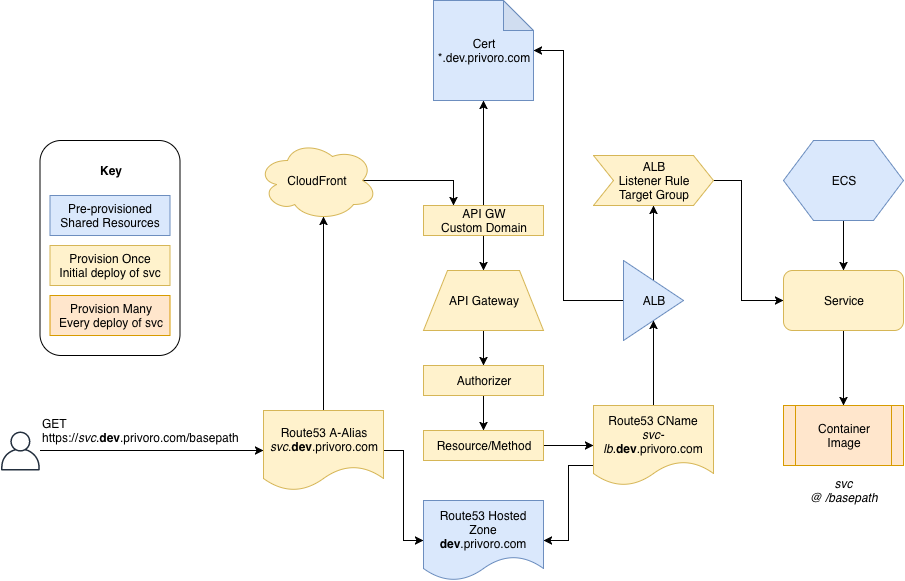

# Serverless ECS Service
Enables you to deploy docker images to (a preconfigured) ECS Cluster.

The plugin is configured with references to the pre-provisioned resources and with the service (to be deployed to ECS) details.

On deployment, the container image for the service is built and pushed to ECR. The service CloudFormation stack will provision APIGateway resources, Route53 record sets, Application Load Balancer rules, ECS Services, and Task Definitions to publish and expose the ECS service via API Gateway.

# Prerequisite setup
- Existing VPC
- Existing (fargate) ECS cluster to host services.
- Existing Application LoadBalancer 
  - HTTPS listener
- Existing CNAME record for loadbalancer that satisfies ALB certificate
- Existing HOSTED Zone for subdomains created for ecs service
- Existing SSL Certificate for subdomains matching the configured hosted zone (in us-east-1) 

# TODO Feature
- make loadbalancer dns private? (probably requires second hosted zone)

#TODO Demo Cleanup
- CNAME: sls-plugin-demo.dev.privoro.com.
- ALB: arn:aws:elasticloadbalancing:us-west-2:492058901556:loadbalancer/app/serverless-plugin-test/e3dd81d3e5b6f9bc
- ECS: serverless-plugin-test
- ssl cert in us-east-1 for dev/qa.privoro.com

#TODO Env setup
CloudFormation template that stands up ECS, ALB, Certs for usage in deployment
