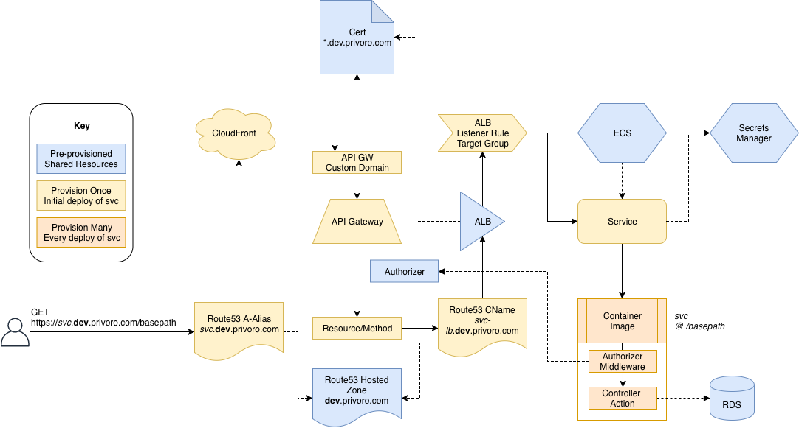

# Serverless ECS Service
Enables you to deploy docker images to (a preconfigured) ECS Cluster. In addition to functions or resources defined in the serverless configuration file.


## Commands

### ECS-BUILD 
This command is used to build and push the docker images to ECR. 

``` 
serverless ecs-build --stage dev --region us-west-2
```

### DEPLOY
This plugin hooks into the `serverless deploy` life cycle to add ECS resources to the cloudformation stack deployed.
After enabling this plugin for your service you should run `serverless ecs-build` prior to deploy. 


``` 
serverless deploy --stage dev --region us-west-2
```
#### TODO
- [ ] build in a check on deploy hook and trigger build automatically if configured image name is not in ECR


### ECS-RESTART
This command is used to force a new deployment of the ECS services to make sure services are using the latest image in the ECR.
If your services use `:latest` tags, then `serverless deploy` typically won't result in the new image being used unless you've changed
environment variables, scale or some other configuration of the task definition. In order to get the services to use the fresh new image, you have to
force a new deployment.

``` 
serverless ecs-restart --stage dev --region us-west-2
```


## About
For containers specified in the plugin config:
 * images will be built and pushed to ECR
 * An ECS Service & TaskDefinition will be created in a pre-configured ECS Cluster
 * A route to the service will be added to a pre-configured elastic load balancer using the configured basePath name
 * An internal route53 cname will be created for the service that points to the ELB
 * An API Gateway Resource with proxy method will be created that proxies HTTP requests to the load balancer (using the route53 domain name) 
 * A public route53 cname will be created for the service that points to the API Gateway endpoint 



The plugin is configured with references to the pre-provisioned resources and with the service's (to be deployed to ECS) details. 

On deployment, the container image for the service is built and pushed to ECR. The service CloudFormation stack will provision APIGateway resources, Route53 record sets, Application Load Balancer rules, ECS Services, and Task Definitions to publish and expose the ECS service via API Gateway.

# Prerequisite setup
- Existing VPC
- Existing (fargate) ECS cluster to host services.
- Existing Application LoadBalancer 
  - HTTPS listener
- Existing CNAME record for loadbalancer that satisfies ALB certificate
- Existing HOSTED Zone for subdomains created for ecs service
- Existing SSL Certificate for subdomains matching the configured hosted zone (in us-east-1) 

# TODO Feature
- make loadbalancer dns private? (probably requires second hosted zone)

#TODO Demo Cleanup
- CNAME: sls-plugin-demo.dev.privoro.com.
- CNAME: sls-demo.dev.privoro.com.
- ALB: arn:aws:elasticloadbalancing:us-west-2:492058901556:loadbalancer/app/serverless-plugin-test/e3dd81d3e5b6f9bc
- ECS: serverless-plugin-test
- ssl cert in us-east-1 for dev/qa.privoro.com
- secrets manager: oauth client credentials
- secrets manager: aws credentials

#TODO Env setup
CloudFormation template that stands up ECS, ALB, Certs for usage in deployment
